# Genuary 2026 Art

31 generative artworks I created for Genuary 2026. Click any piece to view it
live.

<a href="https://dylan-eck.github.io/genuary-2026/01/">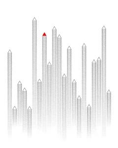</a><a href="https://dylan-eck.github.io/genuary-2026/02/">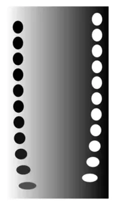</a><a href="https://dylan-eck.github.io/genuary-2026/03/">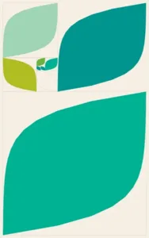</a><a href="https://dylan-eck.github.io/genuary-2026/04/">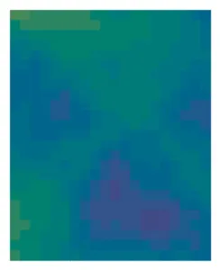</a><a href="https://dylan-eck.github.io/genuary-2026/05/">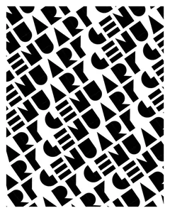</a><a href="https://dylan-eck.github.io/genuary-2026/06/">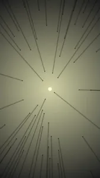</a> 
<a href="https://dylan-eck.github.io/genuary-2026/07/">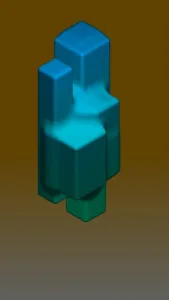</a><a href="https://dylan-eck.github.io/genuary-2026/09/">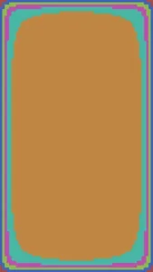</a><a href="https://dylan-eck.github.io/genuary-2026/10/">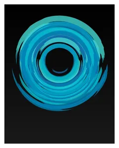</a><a href="https://dylan-eck.github.io/genuary-2026/11/">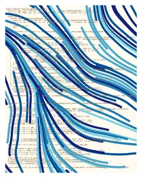</a><a href="https://dylan-eck.github.io/genuary-2026/12/">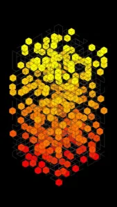</a> 
<a href="https://dylan-eck.github.io/genuary-2026/13/">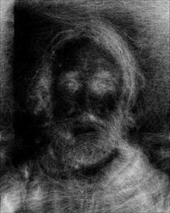</a><a href="https://dylan-eck.github.io/genuary-2026/14/">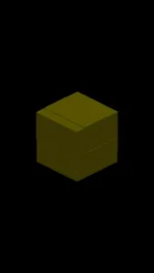</a><a href="https://dylan-eck.github.io/genuary-2026/15/">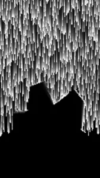</a><a href="https://dylan-eck.github.io/genuary-2026/16/">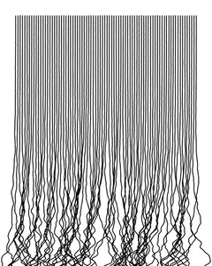</a><a href="https://dylan-eck.github.io/genuary-2026/17/">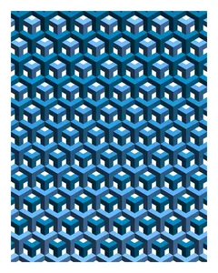</a><a href="https://dylan-eck.github.io/genuary-2026/18/">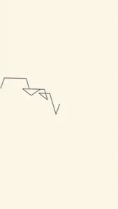</a> 
<a href="https://dylan-eck.github.io/genuary-2026/19/">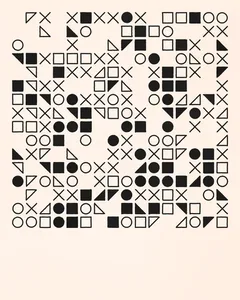</a><a href="https://dylan-eck.github.io/genuary-2026/20/">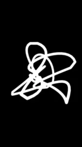</a><a href="https://dylan-eck.github.io/genuary-2026/21/">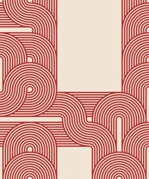</a><a href="https://dylan-eck.github.io/genuary-2026/22/">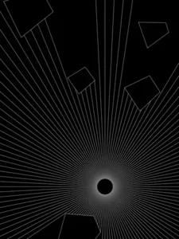</a><a href="https://dylan-eck.github.io/genuary-2026/23/">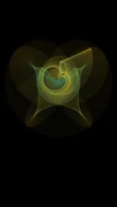</a><a href="https://dylan-eck.github.io/genuary-2026/24/">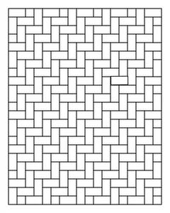</a> 
<a href="https://dylan-eck.github.io/genuary-2026/25/">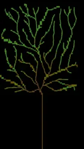</a><a href="https://dylan-eck.github.io/genuary-2026/26/">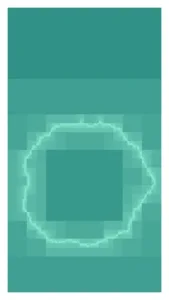</a><a href="https://dylan-eck.github.io/genuary-2026/28/">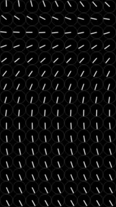</a><a href="https://dylan-eck.github.io/genuary-2026/29/">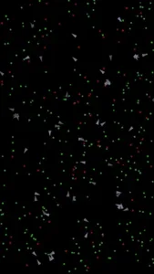</a><a href="https://dylan-eck.github.io/genuary-2026/30/">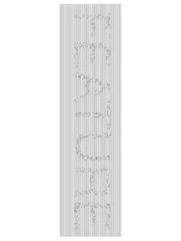</a><a href="https://dylan-eck.github.io/genuary-2026/31/">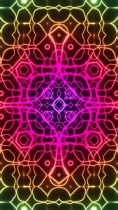</a>

## About

Genuary is a month-long generative art challenge that takes place each year in
January. You can learn more about Genuary at
[genuary.art](https://genuary.art/). All of the pieces are also available at
[dylan-eck.github.io/genuary-2026](https://dylan-eck.github.io/genuary-2026/).

## Built with

- [p5.js](https://p5js.org/) for drawing, animation, and input in most pieces
- Custom GLSL shaders for the GPU-heavy pieces (9 of the 31), including
  raymarching (07), cellular automata (09, 27), and a multi-pass bloom pipeline
  (20)
- [culori](https://culorijs.org/) for OKLCH palettes and color interpolation
- [p5.js-svg](https://github.com/zenozeng/p5.js-svg) for vector output (22, 30)
- Plain HTML/CSS with no canvas for day 28
- Hosted on GitHub Pages. There is no build step, and libraries load from CDNs.

Dev tooling: Prettier for formatting, and Playwright scripts in `tools/` that
capture the preview images and README thumbnails.

## Running locally

You can run this repository locally using python. After cloning, run the
following command at the root of the repository:

`python -m http.server 8000 --directory src`

Then open a browser window and navigate to http://localhost:8000/

## License

Copyright (c) 2026 Dylan Eck.

- **Code** is licensed under the
  [PolyForm Noncommercial License 1.0.0](LICENSE.md). You may use, modify, and
  share it, including running the sketches, only for non-commercial purposes.
- **Artwork** (images, videos, and other visual output from the sketches) is
  licensed under
  [CC BY-NC 4.0](https://creativecommons.org/licenses/by-nc/4.0/).

For commercial use of either, please get in touch.

### Third-party

- `src/lib/OpenSimplexNoise.js` is adapted from
  [joshforisha/open-simplex-noise-js](https://github.com/joshforisha/open-simplex-noise-js)
  and is in the public domain under the
  [Unlicense](https://unlicense.org/).
- The Google Sans Code font in `src/11/assets/fonts/` is licensed under the
  [SIL Open Font License 1.1](src/11/assets/fonts/Google_Sans_Code/OFL.txt).
- p5.js, p5.js-svg, and culori are loaded from CDNs under their own licenses.
