# Genuary 2026 Art

31 generative artworks I created for Genuary 2026. Click any piece below to run
it in your browser.

<a href="https://dylan-eck.github.io/genuary-2026/01/">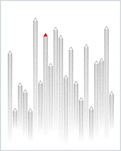</a><a href="https://dylan-eck.github.io/genuary-2026/02/">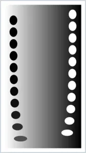</a><a href="https://dylan-eck.github.io/genuary-2026/03/">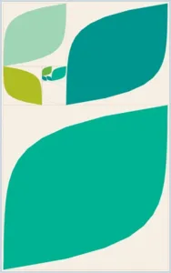</a><a href="https://dylan-eck.github.io/genuary-2026/04/">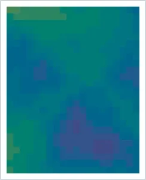</a><a href="https://dylan-eck.github.io/genuary-2026/05/">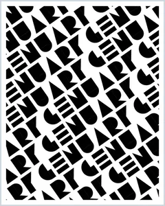</a><a href="https://dylan-eck.github.io/genuary-2026/06/">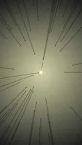</a> 
<a href="https://dylan-eck.github.io/genuary-2026/07/">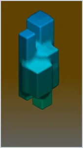</a><a href="https://dylan-eck.github.io/genuary-2026/09/">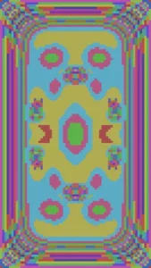</a><a href="https://dylan-eck.github.io/genuary-2026/10/">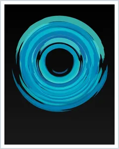</a><a href="https://dylan-eck.github.io/genuary-2026/11/">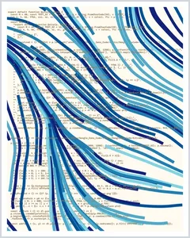</a><a href="https://dylan-eck.github.io/genuary-2026/12/">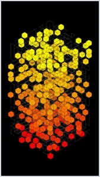</a> 
<a href="https://dylan-eck.github.io/genuary-2026/13/">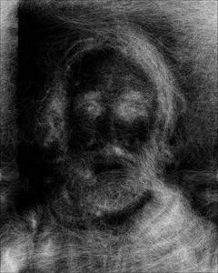</a><a href="https://dylan-eck.github.io/genuary-2026/14/">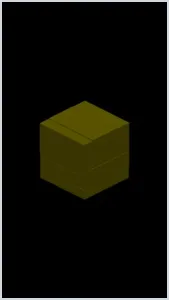</a><a href="https://dylan-eck.github.io/genuary-2026/15/">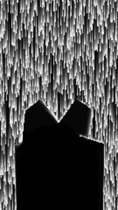</a><a href="https://dylan-eck.github.io/genuary-2026/16/">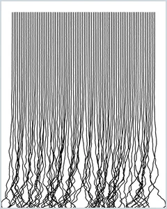</a><a href="https://dylan-eck.github.io/genuary-2026/17/">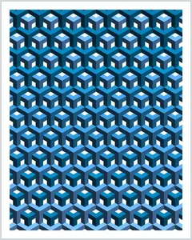</a><a href="https://dylan-eck.github.io/genuary-2026/18/">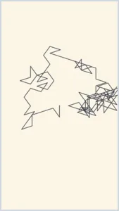</a> 
<a href="https://dylan-eck.github.io/genuary-2026/19/">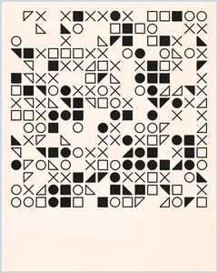</a><a href="https://dylan-eck.github.io/genuary-2026/20/">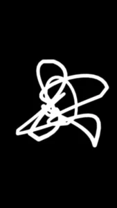</a><a href="https://dylan-eck.github.io/genuary-2026/21/">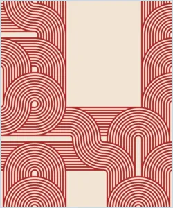</a><a href="https://dylan-eck.github.io/genuary-2026/22/">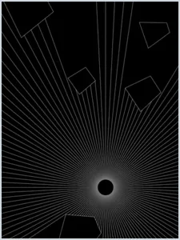</a><a href="https://dylan-eck.github.io/genuary-2026/23/">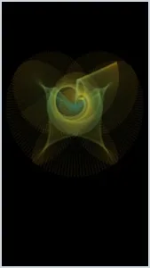</a><a href="https://dylan-eck.github.io/genuary-2026/24/">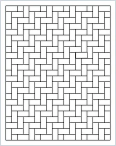</a> 
<a href="https://dylan-eck.github.io/genuary-2026/25/">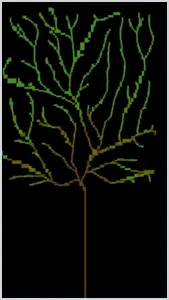</a><a href="https://dylan-eck.github.io/genuary-2026/26/">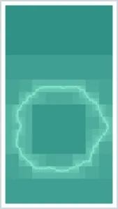</a><a href="https://dylan-eck.github.io/genuary-2026/27/">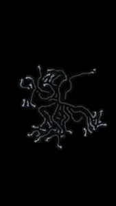</a><a href="https://dylan-eck.github.io/genuary-2026/28/">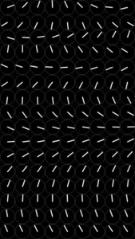</a><a href="https://dylan-eck.github.io/genuary-2026/29/">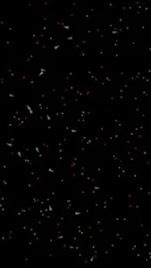</a><a href="https://dylan-eck.github.io/genuary-2026/30/">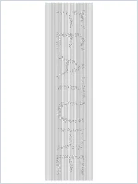</a><a href="https://dylan-eck.github.io/genuary-2026/31/">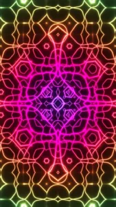</a>

## About

Genuary is a month-long generative art challenge that takes place each year in
January. You can learn more about Genuary at
[genuary.art](https://genuary.art/).

While the preview images above are single frames, many of the pieces are
animated. The [project website](https://dylan-eck.github.io/genuary-2026/) has
the full version of every piece. Most of the pieces make use of randomness, and
you can press <kbd>Space</kbd> on a piece's page to generate a new variation.
The seed is kept in the URL (`?seed=...`), so you can share or revisit a
specific variation.

## Highlights

- [**Day 07**](https://dylan-eck.github.io/genuary-2026/07/): Ray-marched 3D scene, rendered entirely in a fragment
  shader using signed distance functions and smooth unions.
- [**Day 11**](https://dylan-eck.github.io/genuary-2026/11/): A self-printing quine. The sketch draws its own source
  code as part of the artwork.
- [**Day 15**](https://dylan-eck.github.io/genuary-2026/15/): Falling-sand simulation around an invisible rotating
  object. The object is never drawn and only shows up in how the sand piles.
- [**Day 20**](https://dylan-eck.github.io/genuary-2026/20/): Custom GLSL multi-pass bloom pipeline: a bright
  pass, a two-pass Gaussian blur, and a final composite.
- [**Day 25**](https://dylan-eck.github.io/genuary-2026/25/): A tree grown with the space colonization algorithm,
  where branches extend toward randomly scattered attractor points.
- [**Day 27**](https://dylan-eck.github.io/genuary-2026/27/): Multiple-neighborhood cellular automaton running on the
  GPU. Each cell's update depends on two neighborhoods, an outer ring and an
  inner disc.

## Pieces

| Day | Prompt                                                                                                     | Link                                                 |
| --- | ---------------------------------------------------------------------------------------------------------- | ---------------------------------------------------- |
| 01  | One color, one shape.                                                                                      | [View](https://dylan-eck.github.io/genuary-2026/01/) |
| 02  | Twelve principles of animation.                                                                            | [View](https://dylan-eck.github.io/genuary-2026/02/) |
| 03  | Fibonacci forever. Create a work that uses the Fibonacci sequence in some way.                             | [View](https://dylan-eck.github.io/genuary-2026/03/) |
| 04  | Lowres. An image or graphic with low resolution, where details are simplified or pixelated.                | [View](https://dylan-eck.github.io/genuary-2026/04/) |
| 05  | Write “Genuary”. Avoid using a font.                                                                       | [View](https://dylan-eck.github.io/genuary-2026/05/) |
| 06  | Lights on/off. Make something that changes when you switch on or off the “digital” lights.                 | [View](https://dylan-eck.github.io/genuary-2026/06/) |
| 07  | Boolean algebra. Get inspired by Boolean algebra, in any way.                                              | [View](https://dylan-eck.github.io/genuary-2026/07/) |
| 08  | A City. Create a generative metropolis.                                                                    | [View](https://dylan-eck.github.io/genuary-2026/08/) |
| 09  | Crazy automaton. Cellular automata with crazy rules.                                                       | [View](https://dylan-eck.github.io/genuary-2026/09/) |
| 10  | Polar coordinates.                                                                                         | [View](https://dylan-eck.github.io/genuary-2026/10/) |
| 11  | Quine. A Quine is a form of code poetry, it's a computer program that outputs exactly its own source code. | [View](https://dylan-eck.github.io/genuary-2026/11/) |
| 12  | Boxes only.                                                                                                | [View](https://dylan-eck.github.io/genuary-2026/12/) |
| 13  | Self portrait.                                                                                             | [View](https://dylan-eck.github.io/genuary-2026/13/) |
| 14  | Everything fits perfectly.                                                                                 | [View](https://dylan-eck.github.io/genuary-2026/14/) |
| 15  | Create an invisible object where only the shadows can be seen.                                             | [View](https://dylan-eck.github.io/genuary-2026/15/) |
| 16  | Order and disorder.                                                                                        | [View](https://dylan-eck.github.io/genuary-2026/16/) |
| 17  | Wallpaper group. There are only 17 ways to cover a plane with a repeating pattern.                         | [View](https://dylan-eck.github.io/genuary-2026/17/) |
| 18  | Unexpected path. Draw a route that changes direction based on one very simple rule.                        | [View](https://dylan-eck.github.io/genuary-2026/18/) |
| 19  | 16x16                                                                                                      | [View](https://dylan-eck.github.io/genuary-2026/19/) |
| 20  | One line. An artwork that is made of a single line only.                                                   | [View](https://dylan-eck.github.io/genuary-2026/20/) |
| 21  | Bauhaus Poster. Create a poster design inspired by the German art school Bauhaus.                          | [View](https://dylan-eck.github.io/genuary-2026/21/) |
| 22  | Pen plotter ready.                                                                                         | [View](https://dylan-eck.github.io/genuary-2026/22/) |
| 23  | Transparency. Explore the concept of transparency.                                                         | [View](https://dylan-eck.github.io/genuary-2026/23/) |
| 24  | Perfectionist's nightmare.                                                                                 | [View](https://dylan-eck.github.io/genuary-2026/24/) |
| 25  | Organic Geometry. Forms that look or act organic but are constructed entirely from geometric shapes.       | [View](https://dylan-eck.github.io/genuary-2026/25/) |
| 26  | Recursive Grids. Split the canvas into a grid of some kind and recurse on each cell again and again.       | [View](https://dylan-eck.github.io/genuary-2026/26/) |
| 27  | Lifeform. A shape or structure that behaves as if it's alive or growing.                                   | [View](https://dylan-eck.github.io/genuary-2026/27/) |
| 28  | No libraries, no canvas, only HTML elements.                                                               | [View](https://dylan-eck.github.io/genuary-2026/28/) |
| 29  | Genetic evolution and mutation.                                                                            | [View](https://dylan-eck.github.io/genuary-2026/29/) |
| 30  | Its not a bug, its a feature.                                                                              | [View](https://dylan-eck.github.io/genuary-2026/30/) |
| 31  | GLSL day. Create an artwork using only shaders.                                                            | [View](https://dylan-eck.github.io/genuary-2026/31/) |

## Built with

- [p5.js](https://p5js.org/) for drawing, animation, and input in most pieces
- Custom GLSL shaders for the GPU-heavy pieces (9 of the 31)
- [culori](https://culorijs.org/) for OKLCH palettes and color interpolation
- [p5.js-svg](https://github.com/zenozeng/p5.js-svg) for vector output (22, 30)
- Plain HTML/CSS with no canvas for day 28
- Hosted on GitHub Pages. There is no build step, and libraries load from CDNs.

Dev tooling: Prettier for formatting, and Playwright scripts in `tools/` that
capture the preview images and README thumbnails.

## Running locally

You can run this repository locally using python. After cloning, run the
following command at the root of the repository:

`python -m http.server 8000 --directory src`

Then open a browser window and navigate to http://localhost:8000/

## License & Credits

Copyright (c) 2026 Dylan Eck.

- **Code** is licensed under the
  [PolyForm Noncommercial License 1.0.0](LICENSE.md). You may use, modify, and
  share it, including running the sketches, only for non-commercial purposes.
- **Artwork** (images, videos, and other visual output from the sketches) is
  licensed under
  [CC BY-NC 4.0](https://creativecommons.org/licenses/by-nc/4.0/).

### Third-party

- The Google Sans Code font in `src/11/assets/fonts/` is licensed under the
  [SIL Open Font License 1.1](src/11/assets/fonts/Google_Sans_Code/OFL.txt).
- p5.js, p5.js-svg, and culori are loaded from CDNs under their own licenses.
